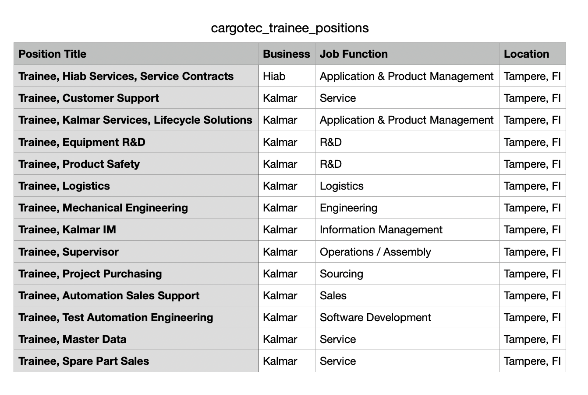

# Cargotec Careers Scraper

This script is designed to scrape job information from the Cargotec Careers website using Selenium and Python.

# Note:--> Below instruction is for local environment only

## Prerequisites

Before running the script, make sure you have the following installed:

- [Python](https://www.python.org/downloads/) (version 3.x)
- [ChromeDriver](https://sites.google.com/chromium.org/driver/) (ensure it matches your Chrome browser version)
- Python packages (install using `pip install package_name`):
  - selenium
  - pytest
  - brew install --cask --no-quarantine google-chrome (Macbook)

## Usage

1.  Clone the repository to your local machine:

   ```bash
   git clone https://github.com/Razib91lightspeed/interview_challenge.git
   ```


2. Go to the interview_challenge direcotry

   ```bash
   cd interview_challenge
   ```

3. Run the script

   ```bash
   pytest test_cargotec_careers.py
   ```

3. Go to test directory

   ```bash
   cd test
   ```

4. Varify CVS file content

   ```bash
   cat cargotec_trainee_positions.csv
   ```

5. Open CVS file to check if all job listed or not

   


