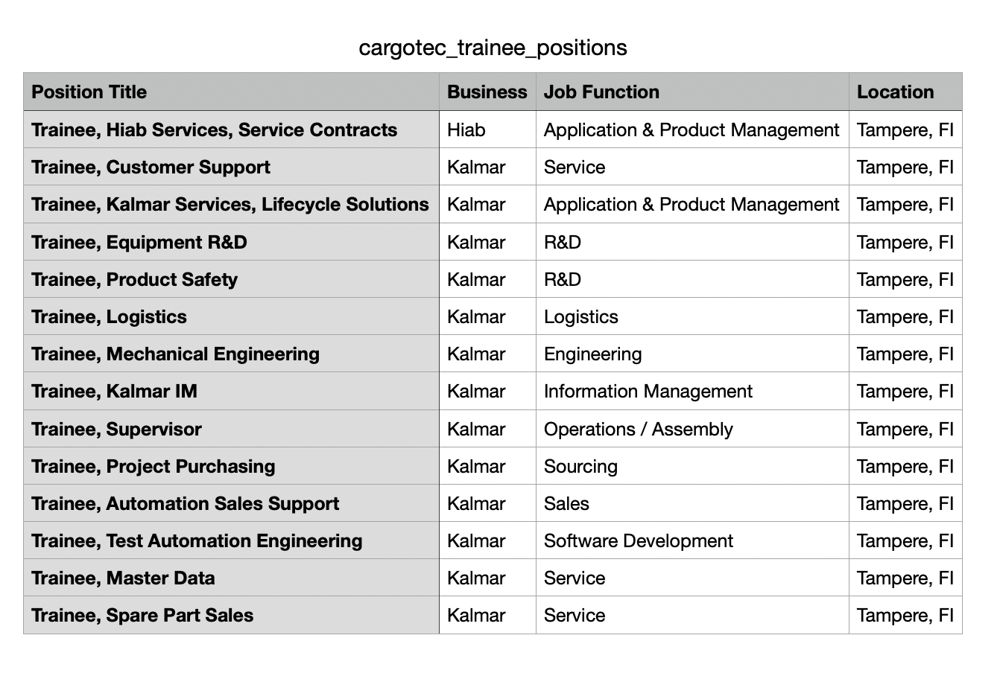

# Test Automation Assignment: Cargotec Careers Page

## Objective
The goal of this assignment is to create a test automation case for finding all trainee positions in Tampere from Cargotec Careers page.
Submit your tests in a `./tests` folder,
**please also include instructions of how to run them.**

**The test case should have following steps implemented**
1. Opening the browser.
2. Navigation to the Cargotec careers page.
3. Search for trainee positions in Tampere.
4. Creation of a CSV file into `./tests` folder.
    - Columns: Position Title, Business, Job Function, Location
5. Get all trainee positions open in Tampere and add those into the created CSV file and save changes.
6. **Extra:** Verify that the postion you've applied in can be found from the CSV file

## Prerequisites
Make sure that you have python 3.11 installed locally or you can use Python virtual environment.
Ensure that the necessary test automation tools and frameworks are set up and defined in requirements.txt

## Test Framework
Choose either Robot Framework or Python with pytest for implementing the test automation case.

## Note
Ensure that you have the necessary plugins or libraries installed for the selected test framework. Customize the script to match the syntax and conventions of Robot Framework or pytest. Additionally, consider adding error handling and assertions for a more robust test suite.